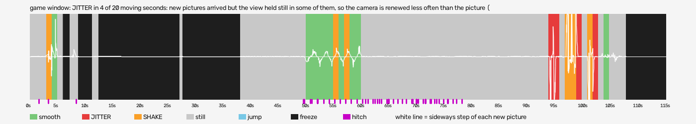

# first-obs-run (alice-madness-returns-vr)

Run `2026-10-07_12-54-35_first-obs-run`, checked 2026-10-08 16:05 by BeG0nE jitter tool 0.1.0. Every claim below is `[measured]`: one recording, one scene.

## game window

JITTER in 4 of 20 moving seconds: new pictures arrived but the view held still in some of them, so the camera is renewed less often than the picture (a rate fault). SHAKE in 6 seconds: the view moved back against itself or wobbled. 6 freeze(s) of a second or more. 83 short hitches (frame rate, not the camera). Only 21.6 new pictures a second reached the recording, so small unevenness may come from the capture, not the game.

- quality: **good**
- 115.3 s, 1280x720, 21.6 new pictures a second
- moving 20 s: smooth 10, jitter 4, shake 6; still 63 s
- freezes 6, hitches 83
- jitter at (s): 94, 95, 99, 102
- shake at (s): 3, 55, 57, 97, 98, 101

