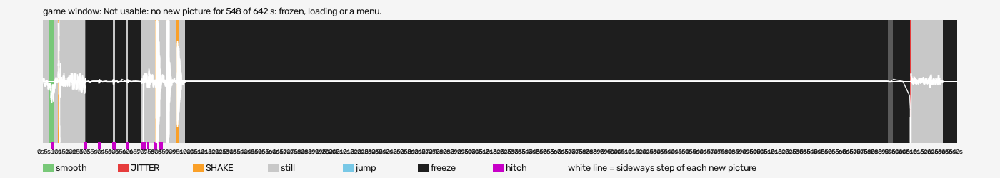

# hud-baseline (bulletstorm-vr)

Run `2026-10-07_16-41-17_hud-baseline`, checked 2026-10-08 16:08 by BeG0nE jitter tool 0.1.0. Every claim below is `[measured]`: one recording, one scene.

## game window

Not usable: no new picture for 548 of 642 s: frozen, loading or a menu.

- quality: **faulty** (no new picture for 548 of 642 s: frozen, loading or a menu)
- 641.62 s, 640x720, 49.0 new pictures a second
- moving 7 s: smooth 4, jitter 1, shake 8; still 77 s
- freezes 17, hitches 163
- jitter at (s): 609
- shake at (s): 11, 79, 80, 81, 87, 88, 94, 95

