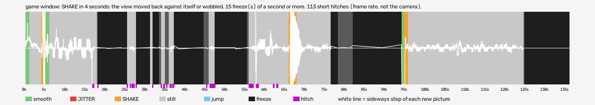

# hud-per-eye (bulletstorm-vr)

Run `2026-10-07_16-52-50_hud-per-eye`, checked 2026-10-08 16:09 by BeG0nE jitter tool 0.1.0. Every claim below is `[measured]`: one recording, one scene.

## game window

SHAKE in 4 seconds: the view moved back against itself or wobbled. 15 freeze(s) of a second or more. 113 short hitches (frame rate, not the camera).

- quality: **good**
- 136.42 s, 640x720, 46.3 new pictures a second
- moving 5 s: smooth 3, jitter 0, shake 4; still 72 s
- freezes 15, hitches 113
- shake at (s): 4, 66, 67, 95

