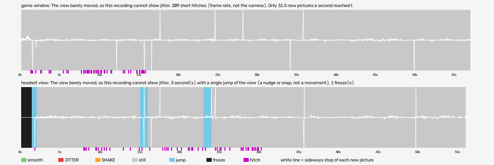

# head-tracking (hard-reset-vr)

Run `2026-10-07_16-30-35_head-tracking`, checked 2026-10-08 16:04 by BeG0nE jitter tool 0.1.0. Every claim below is `[measured]`: one recording, one scene.

## game window

The view barely moved, so this recording cannot show jitter. 209 short hitches (frame rate, not the camera). Only 31.5 new pictures a second reached the recording, so small unevenness may come from the capture, not the game.

- quality: **no-movement** (the view hardly moved, so jitter cannot be judged (freezes and hitches still count))
- 57.33 s, 640x720, 31.5 new pictures a second
- moving 0 s: smooth 0, jitter 0, shake 0; still 57 s
- freezes 0, hitches 209

## headset view

The view barely moved, so this recording cannot show jitter. 3 second(s) with a single jump of the view (a nudge or snap, not a movement). 1 freeze(s) of a second or more. 103 short hitches (frame rate, not the camera). Only 29.8 new pictures a second reached the recording, so small unevenness may come from the capture, not the game.

- quality: **no-movement** (the view hardly moved, so jitter cannot be judged (freezes and hitches still count))
- 56.9 s, 864x224, 29.8 new pictures a second
- moving 0 s: smooth 0, jitter 0, shake 0; still 52 s
- freezes 1, hitches 103

## The two views together

The headset view froze while the game window kept moving: the VR side stopped receiving pictures.

